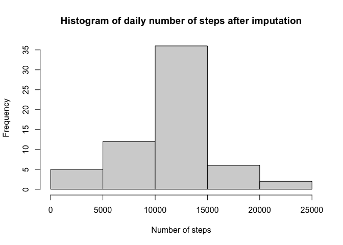

## Loading and preprocessing the data
The following code shows how the data was imported.
**Note:** When testing the file on RStudio, set your working directory by selecting the folder under the Files tab, clicking More followed by *Set As Working Directory*

```r
data <- read.csv('activity.csv')
```

## Histogram showing the total number of steps taken everyday
The following code was used to determine the total number of steps per day

```r
agg <- aggregate(steps~date,data,sum)
hist(agg$steps)
```

<!-- -->

## What is mean total number of steps taken per day?

```r
meansteps <- mean(agg$steps)
mediansteps <- median(agg$steps)
```
The mean number of steps per day is 10766.19 and the median number of steps is 10765.  

## What is the average daily activity pattern?
The following code is used to determine the average number of steps per 5-min interval and plots the resulting data

```r
dayagg <- aggregate(steps~interval,data,mean)
plot(dayagg$interval,dayagg$steps,type = "l",xlab='Time of day',ylab='Average number of steps', main='Average daily number of steps per 5-min interval')
```

<!-- -->
The following code is used to determine the interval that contains the largest number of steps

```r
maxsteps <- max(dayagg$steps)
indmax <- which(dayagg$steps == maxsteps)
maxintbeg <- dayagg[indmax - 1, 'interval']
maxintend <- dayagg[indmax, 'interval']
```
The time at which the maximum number of steps occur is between 830 and 835. 

## Imputing missing values
All missing values were imputed using the average number of steps for that particular 5-min interval. Then, a histogram is plotted using the imputed data

```r
data$steps[is.na(data$steps)] <- dayagg$steps[match(data$interval,dayagg$interval)][which(is.na(data$steps))]
impagg <- aggregate(steps~date,data,sum)
hist(impagg$steps)
```

<!-- -->

The following code is used to determine the mean and median for the imputed dataset

```r
impmeansteps <- mean(impagg$steps)
impmediansteps <- median(impagg$steps)
```

The mean number of steps per day is 10766.19 and the median number of steps is 10766.19.

## Are there differences in activity patterns between weekdays and weekends?
