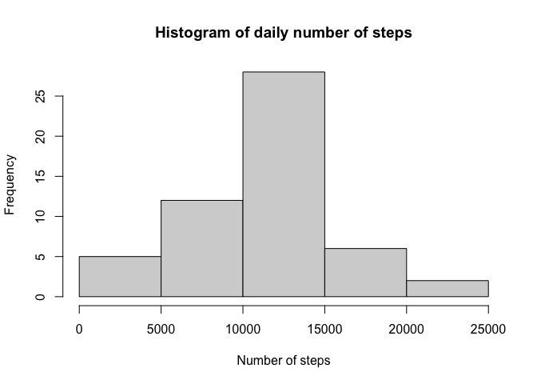
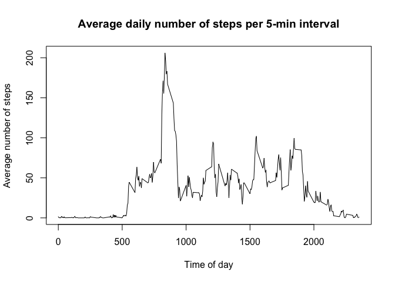
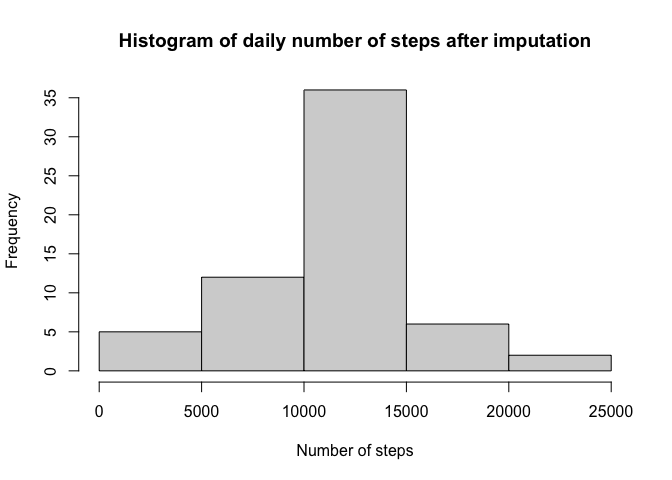
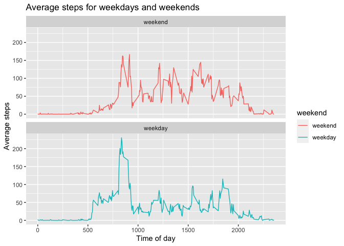

## Loading and preprocessing the data
The following code shows how the data was imported.
**Note:** When testing the code on RStudio, donwload the csv and markdown files to your folder of interest. Then, set your working directory by selecting the appropriate folder under the Files tab, clicking More followed by *Set As Working Directory*.

```r
fil <- download.file('https://d396qusza40orc.cloudfront.net/repdata%2Fdata%2Factivity.zip','activity.zip')
unzip('activity.zip')
data <- read.csv('activity.csv')
```

## Histogram showing the total number of steps taken everyday
The following code was used to determine the total number of steps per day

```r
agg <- aggregate(steps~date,data,sum)
hist(agg$steps,xlab='Number of steps',ylab='Frequency', main='Histogram of daily number of steps')
```

<!-- -->

## What is mean total number of steps taken per day?

```r
meansteps <- mean(agg$steps)
mediansteps <- median(agg$steps)
```
The mean number of steps per day is 10766.19 and the median number of steps is 10765.  

## What is the average daily activity pattern?
The following code is used to determine the average number of steps per 5-min interval and plots the resulting data

```r
dayagg <- aggregate(steps~interval,data,mean)
plot(dayagg$interval,dayagg$steps,type = "l",xlab='Time of day',ylab='Average number of steps', main='Average daily number of steps per 5-min interval')
```

<!-- -->

The following code is used to determine the interval that contains the largest number of steps

```r
maxsteps <- max(dayagg$steps)
indmax <- which(dayagg$steps == maxsteps)
maxintbeg <- dayagg[indmax - 1, 'interval']
maxintend <- dayagg[indmax, 'interval']
```
The time at which the maximum number of steps occur is between 830 and 835. 

## Imputing missing values
All missing values were imputed using the average number of steps for that particular 5-min interval. Then, a histogram is plotted using the imputed data. 

```r
data$steps[is.na(data$steps)] <- dayagg$steps[match(data$interval,dayagg$interval)][which(is.na(data$steps))]
impagg <- aggregate(steps~date,data,sum)
hist(impagg$steps,xlab='Number of steps',ylab='Frequency', main='Histogram of daily number of steps after imputation')
```

<!-- -->

The only difference between the unimputed and imputed histograms is the height of the column showing the frequency of days between 10k and 15k steps. Its frequency goes up from 30 to 35 after imputation.

The following code is used to determine the mean and median for the imputed dataset

```r
impmeansteps <- mean(impagg$steps)
impmediansteps <- median(impagg$steps)
```

The mean number of steps per day is 10766.19 and the median number of steps is 10766.19.

## Are there differences in activity patterns between weekdays and weekends?
The following code adds a column labeling weekdays and weekends and produces a plot showing the average number of steps for weekdays and weekends

```r
wkday <- c('Monday','Tuesday','Wednesday','Thursday','Friday')
data$weekend <- factor((weekdays(as.Date(data$date)) %in% wkday), 
         levels=c(FALSE, TRUE), labels=c('weekend', 'weekday'))

wkndagg <- aggregate(steps~interval + weekend,data,mean)

library(ggplot2)

ggplot(data=wkndagg,aes(x=interval,y=steps,color=weekend)) + geom_line() + labs(x='Time of day', y='Average steps',title='Average steps for weekdays and weekends') + facet_wrap(~weekend, ncol=1, nrow=2)
```

<!-- -->

There is an increased number of steps during weekends, mostly in the afternoon and evenings. Also, there is an increase in the number of steps between 5:00 and 10:00 during weekdays, possibly due to commuting and pre-work exercise.
